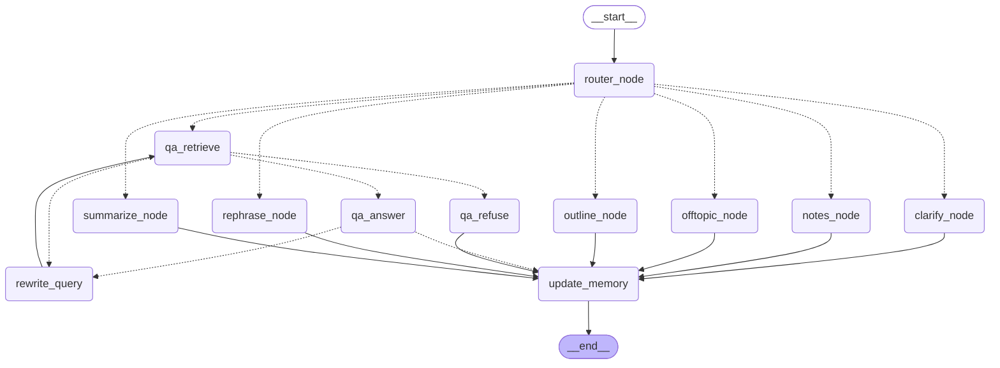

# Academic Assistant - LangGraph Workflow

```mermaid
flowchart TD
	__start__([<p>__start__</p>]):::first
	router_node(router_node)
	qa_retrieve(qa_retrieve)
	rewrite_query(rewrite_query)
	qa_answer(qa_answer)
	qa_refuse(qa_refuse)
	summarize_node(summarize_node)
	notes_node(notes_node)
	outline_node(outline_node)
	rephrase_node(rephrase_node)
	offtopic_node(offtopic_node)
	clarify_node(clarify_node)
	update_memory(update_memory)
	__end__([<p>__end__</p>]):::last
	__start__ --> router_node
	clarify_node --> update_memory
	notes_node --> update_memory
	offtopic_node --> update_memory
	outline_node --> update_memory
	qa_answer -.-> rewrite_query
	qa_answer -.-> update_memory
	qa_refuse --> update_memory
	qa_retrieve -.-> qa_answer
	qa_retrieve -.-> qa_refuse
	qa_retrieve -.-> rewrite_query
	rephrase_node --> update_memory
	rewrite_query --> qa_retrieve
	router_node -.-> clarify_node
	router_node -.-> notes_node
	router_node -.-> offtopic_node
	router_node -.-> outline_node
	router_node -.-> qa_retrieve
	router_node -.-> rephrase_node
	router_node -.-> summarize_node
	summarize_node --> update_memory
	update_memory --> __end__
	classDef default fill:#f2f0ff,line-height:1.2
	classDef first fill-opacity:0
	classDef last fill:#bfb6fc
```
